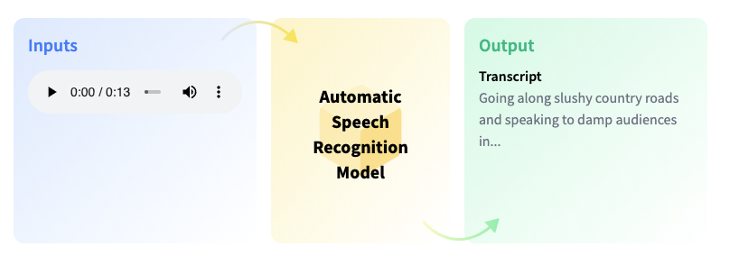
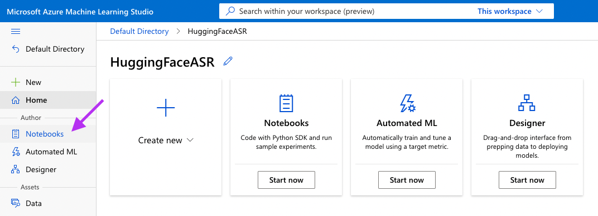
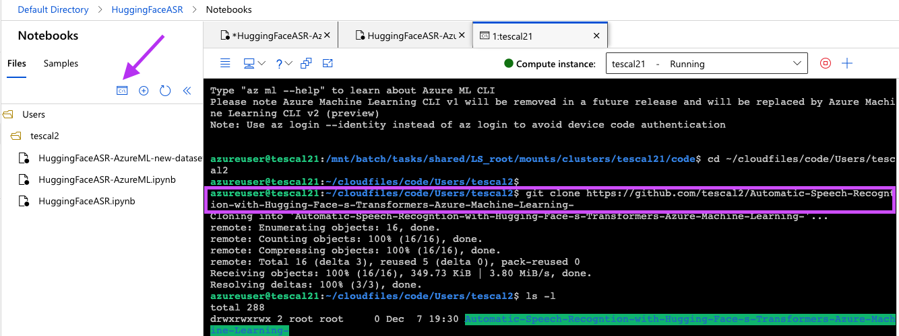

# Automatic Speech Recogntion with Hugging Face's Transformers on Azure MachineLearning

Transformer models are changing the world of machine learning, starting with natural language processing, and now, with audio and computer vision.  Hugging Face's mission is to democratize good machine learning and give anyone the opportunity to use these new state-of-the-art machine learning models.
Together with Azure Machine Learning, you can extend the functionalities of Hugging Face to make it easier to use speech and vision with `transformers`. You can now use this code example to perform [automatic speech recognition](https://huggingface.co/tasks/automatic-speech-recognition) using [Facebook's Wav2Vec2](https://ai.facebook.com/blog/wav2vec-20-learning-the-structure-of-speech-from-raw-audio/) model which can also be found on the [Hugging Face Model Hub](https://huggingface.co/facebook/wav2vec2-large-960h).

In this [example](./HuggingFaceASR-AzureML.ipynb) you will learn how to: 

1. Create an azure Machine Learning Notebook and associate the underlying compute instance
2. Install Dependencies, fetch the pre-trained moel from Hugging Face, and load a sample dataset of audio files
3. Transcribe the audio files into a transcription

Let's get started! 🚀

First you will need to log into your Azure Machine Learning Studio account and head to the notebooks tab:

Next, you will open a terminal and clone the repo in order to open and use the notebook:

Finally, you will execute each cell within the [example notebook](./HuggingFaceASR-AzureML.ipynb).
